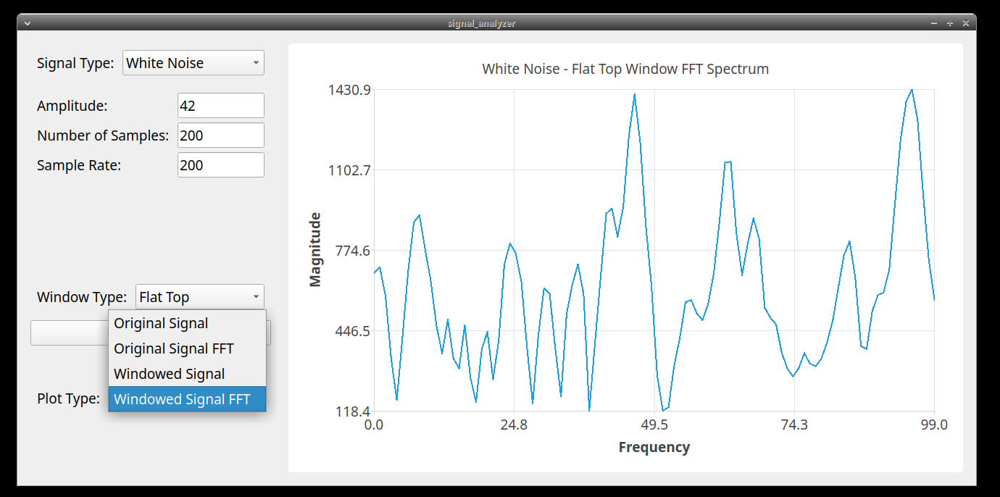

# Signal Analyzer

<p align="center">
  
</p>

## Overview

Signal Analyzer is a C++ application built with Qt that allows users to generate and analyze various types of signals. It includes features such as waveform generation, windowing functions, and Fast Fourier Transform (FFT) analysis. The application provides a GUI where users can interactively select signal types, specify parameters, and visualize the signals and their frequency spectrum.

### **Features**
  - **Signal Generation**: Generate 8 different types of signals (Sine Wave, Square Wave, Sawtooth Wave, Triangle Wave, White Noise, Chirp Signal, Impulse Signal, Gaussian Pulse)
  - **Windowing Functions**: Apply up to 6 different windowing functions (Hanning, Hamming, Blackman, Bartlett, Blackman-Harris, Flat Top)
  - **FFT Analysis**: Perform FFT analysis on the generated signals to visualize the frequency spectrum
  - **Interactive GUI**: The application includes a user-friendly interface built with Qt

<br/>
<p align="center">
    
  <span align="center"> Example Screenshots </span>
</p>

## Installation

To build and run this project, you need to have Qt 5.12.8 or higher installed, along with a C++17 compatible compiler, such as GCC, and the FFTW3 library. 

Ensure you have the following packages installed:
```bash
sudo apt-get install qt5-default libqt5charts5-dev libfftw3-dev
```

Clone and change into the repository:
```bash
git clone https://github.com/feyzanaydemir/signal-analyzer.git
cd signal-analyzer
```

Build and run the application:
```bash
qmake
make
./build/bin/signal-analyzer
```

## License

This project is licensed under the MIT License - see the [LICENSE](LICENSE) file for details.